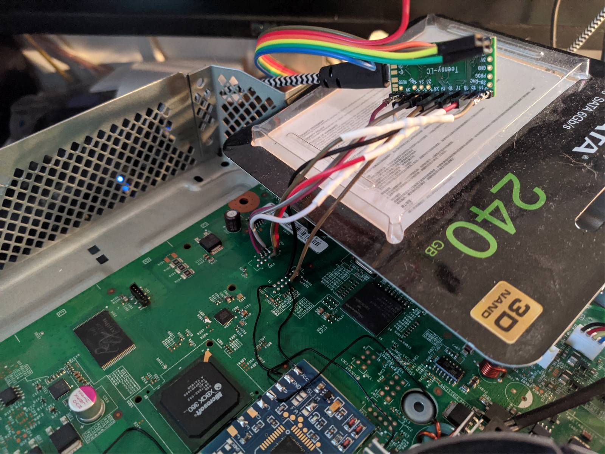

# xbox360-teensy-flasher
XBOX360 NAND reader/writer for Teensy, communicating with PC using USB Serial (with optional debug serial)

Based on the great work of G33KatWork: https://github.com/G33KatWork/XBox-360-AVR-flasher

Tested only on Teensy LC, should work on all Teensys from 3.0 upwards without any changes.
Probably will work even with Atmega based boards (all Arduinos) with few tweaks here and there, but no Teensy specific code has been used. This solution can read and write whole 16MB in about 2,5 minutes - much better than LPT and I already had Teensy LC lying around, so essentially this was a free programmer. If anyone's brave enough to run this on some cheap Arduino knock-off board - this may be a fast and cheap solution for XBOX360 modding.

Tested only on 16MB flash Trinity, don't know if it will behave on any other console (all 16MBs should do fine). There's a different block size on 256/512MB Jaspers, though, so a simple modification might be needed.

Included a modified version of XFlash script to use serial communication.

Modify your pinout in XSPI.h if needed. I used 100 ohm resistors on SCK, SS and MOSI.

Also, what's might be useful - steps I used to program my glitch chip using Raspberry Pi, which I also happen to have lying around: [RPI-XSPF.md](RPI-XSVF.md)

**Highly experimental, YMMV. You're on your own. Use only if you know what you're doing!**

